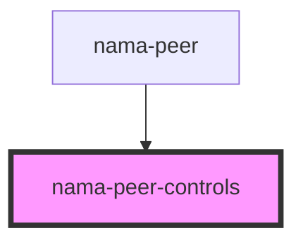

# nama-peer-controls

<!-- Auto Generated Below -->

## Properties

| Property         | Attribute | Description | Type               | Default     |
| ---------------- | --------- | ----------- | ------------------ | ----------- |
| `onOnlineChange` | --        |             | `CallableFunction` | `undefined` |

## Dependencies

### Used by

 - [nama-peer](../nama-peer)

### Graph

----------------------------------------------

*Built with [StencilJS](https://stenciljs.com/)*
