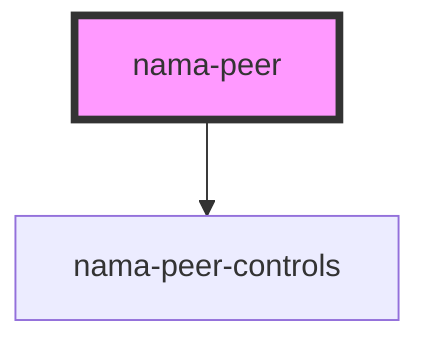

# nama-peer

<!-- Auto Generated Below -->

## Properties

| Property   | Attribute  | Description | Type       | Default    |
| ---------- | ---------- | ----------- | ---------- | ---------- |
| `author`   | `author`   |             | `string`   | `'noname'` |
| `interval` | `interval` |             | `number`   | `1000`     |
| `latency`  | `latency`  |             | `number`   | `0`        |
| `namaDoc`  | --         |             | `Document` | `null`     |

## Events

| Event        | Description | Type                                                                        |
| ------------ | ----------- | --------------------------------------------------------------------------- |
| `namaChange` |             | `CustomEvent<{ peer: string; operations: Operation[]; pruned: string[]; }>` |
| `namaSend`   |             | `CustomEvent<{ peer: string; latency: number; operations: Operation[]; }>`  |

## Dependencies

### Depends on

- [nama-peer-controls](../nama-peer-controls)

### Graph

----------------------------------------------

*Built with [StencilJS](https://stenciljs.com/)*
